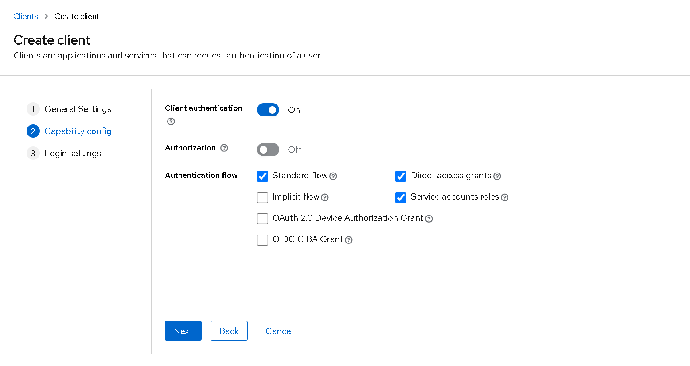
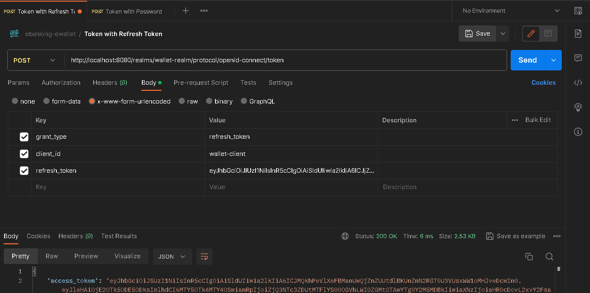

# Ebanking Backend

 

Dans ce rapport, je vais parler sur la sécurité en utilisant Keycloak.
Voici la commande pour lancer le serveur keycloak :

 

le serveur keycloak se trouve dans le port **:8080** par défaut, 

 

Premierment on doit créer un realm :

 

Dans ce realm on doit créer des clients, en passant par les étapes suivantes :

 

Dans cette étape en peut créer des clients sans "**Client authentication**" et pour s'authentifier on utilise soit le mot de passe, soit refresh token

 

Si "**Client authentication**" est activé, on peut s'authentifiant a traves le id du client "wallet_client" et le clé secret

 

la derniere étape c'est de définir les routes :

 

On a términé la configuration du keycloak, maintenant en passent pour teste l'authentification :

 

Authentification par mot de passe :

 

Authentification par refresh token :

 

Authentification par clé de secret :

 

Maintenant on va configurer le backend avec keycloak

 

Les dependences utilisées :

 

La configuration du propriétés

 

Les classes utilisées

 

KeycloakAdapterConfig class

 

SecurityConfig class

 

Pour utiliser keycloakRestTemplate :

 

Sécurisation des méthodes :

